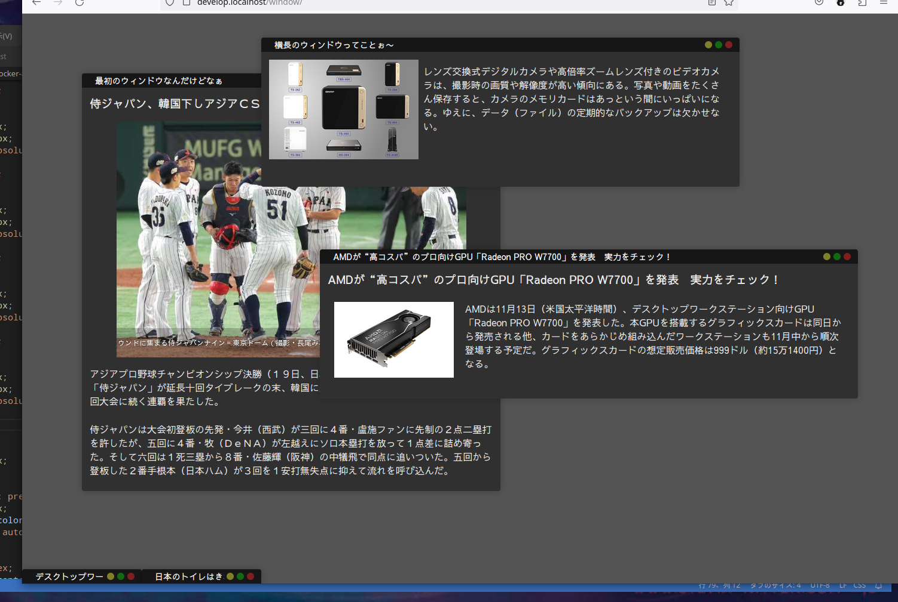

# sweWindow
## 1.概要
sweWindowは、Vanilla JSで動作するブラウザ上で使えるウィンドウ・マネージャです。



基本的にWindowsやMacと同じようなウィンドウ機能です。<br>
ウィンドウヘッダーをドラッグして移動でき、各辺と各角にはリサイズ領域があって、そこにマウスをもっていくとマウスポインタの形状がかわるのでリサイズ出来ます。<br>
ウィンドウの右上にはボタンが３つあり、黄色：最小化、緑：最大化、赤：閉じるとなっています。<br>
ヘッダーのダブルクリックで最大化↔戻るとなります。これは緑の最大化ボタンを押した時と一緒です。<br>
最小化してもしなくてもタスクバーにはウィンドウのボタンが表示されており、タスクバーとウィンドウは１：１の関係です。<br>
タスクバーのボタンを押すと、ウィンドウが前面で出て来ます。既に前面にある場合には最小化されます。<br>
最小化（タスクバーに内包され非表示）されているウィンドウは、タスクバーのボタンを押すと、元に戻ります（元の状態が最大化されていれば最大化）。<br><br>

## 2. 基本構成
- .sweScreen 要素の中に、.sweWindow を並べて初期化すると、.sweScreen を枠として、.sweWindow 一つずつがウィンドウになります。
- .sweScreen は複数置く事が出来ます。更に多段式（ウィンドウの中にスクリーンを設ける事）も出来ます。
<br>

```html
<div.id="targetScreen" class=".swdWindowScreen">
    <div class=".sweWindow">
        ・・・
    </div>
    <div class=".sweWindow">
        ・・・
    </div>
    <div class=".sweWindow">
        ・・・
    </div>
</div>
<script defer src="sweWindow.js"></script>
```

スクリーン下部にタスクバーが生成されます。スクリーン内にウィンドウが無い場合は表示されません。<br><br>

## 3. 使用方法
### 3.1 起動
スクリーンを司る、sweScreen クラス（javascriptのクラス）をインスタンス化すると本機能は開始します。<br>
sweScreenをインスタンス化する時に、どこをスクリーン化するのかを指定する事が出来ます。<br>

```html
const newScreen = new sweScreen("#targetScreen");
```

として起動すると、id="targetScreen"をスクリーンとして、タスクバーが生成され、その中にある（直下のみ）.sweWindowクラスのある要素がウィンドウ化します。<br>

```html
const targetScreen = document.querySelector("#targetScreen");
const newScreen = new sweScreen(targetScreen);
```

のような形でスクリーン要素をそのまま渡す事も出来ます。
> ❗ **Important**
> - 現状ではインスタンス化時に複数のスクリーンを変換する機能を有していません。
> - ".scrren" みたいな形で指定して、コード上に .scrren 要素が複数あった場合には、最初の .scrren だけがスクリーン化されます。
> - 省略すると `<body>` をスクリーンとします。

起動すると、スクリーン要素内の .sweWindow 要素を探して全てウィンドウ化します。<br>
### 3.2 ウィンドウの設定<br>
各ウィンドウの初期設定は、.sweWindow要素の属性として設定する仕様となっています。.sweWindow要素の中身はウィンドウ内のコンテンツをそのまま記してください。<br><br>

### window-id: abcdefg
> このウィンドウを外部からも操作したい場合に、ウィンドウを特定する為に用いるIDです。

### window-title: ウィンドウのタイトル文
> ここにウィンドウのタイトルを記入します。何文字でも設定できますが、長くなると省略されます。タスクバーも同様です。

### rect: { top: 80, left: 80, width: 300, height: 300 },
#### top, left
> スクリーンに左上を0 x 0とした相対位置ウィンドウの左上を設定します（単位はピクセル）。省略した場合はスクリーン右上の80px x 80px に配置されますが、２個めからズレて配置されます。（これの設定は、sweScreenクラスのdefaultConfigに定義されています。
#### width, height
> ウィンドウの初期時の大きさを指定します。省略すると300px x 300pxになります。これも同じ場所で初期値の設定が可能です。

### url: "https://～"
> .sweWindowの中を空にして、別ファイルを取り込むことも出来ます。

### html: "<div>コンテンツ</div>"
> .sweWindowの中を空にしておいて、ここに書く事も出来ます（使い道は思いつきませんが・・・）

### type: "html"
> これはウィンドウのコンテンツタイプです。コンテンツタイプ毎にヘッダーにアイコンを付けようとしていますが、未完成です。

### minSize: { width: 800, height: 400 },
> これはウィンドウリサイズした時の限界まで小さくできる制限です。省略すると 200px x 200px になります。変更したい場合はsweScreenクラスのdefaultConfigを変更してください。

### focus: false
> 起動時にアクティブにするかどうかを決めます。省略するとアクティブになります。省略時の挙動も変更できますが、true/false のどちらかです。

### idDup: "error"
> ウィンドウ起動時に window-id が被った場合の挙動を設定します。

#### 選択肢
```text
**error** 無視してウィンドウを生成しない。<br>
**replace**   同名のwindow-idを閉じて新しいウィンドウとしてせいせいします。<br>
**new**   新しいランダムなwindow-idを付けて生成します。<br><br>
```
初期値では起動しない（ウィンドウが出来ない）となっていますが、これも同様に変更可能です。

### startStatus: "normal"
> ウィンドウ生成時の状態を設定します。省略すると通常のウィンドウとして生成されます。

#### 選択肢
```text
**normal**    普通のウィンドウ<br>
**maximize**  最大化状態<br>
**minimize**  最小化状態<br><br>
```
### flags: { resizable: true, movable: true, closable: true, minimizable: true, maximizable: true }
各種機能制限。ウィンドウに本来ある機能を一部制限します。（未実装）

```text
- resizable
サイズ変更の可否を設定します。<br>
制限する場合は false、デフォルトは true

- movable
移動の可否を設定します。<br>
true/false デフォルトは true

- closable
閉じる事を制限します。<br>
true/false デフォルトは true

- minimizable
最小化する事を制限します。<br>
true/false デフォルトは true

- maximizable
最大化する事を制限します。<br>
true/false デフォルトは true
```
### 3.2 ウィンドウの追加
javascriptからウィンドウを追加する事が出来ます。やり方は２通り。

#### 3.2.1 ウィンドウ要素を先に用意
スクリーン要素内に新しいウィンドウ要素(.sweWindow)を追加して、スクリーンインスタンスに指示を出す。
```js
newScreen.buildWindow();
```
何も引数を設定しなければスクリーン内にある .sweWindow 要素を全てウィンドウ化します。<br>
引数に文字を指定した場合は、要素を探して全てウィンドウ化します。<br>
引数に要素を渡すとその要素をウィンドウ化します。<br>
ウィンドウの初期設定は属性に記します。<br>

#### 3.2.2 JSONで値を渡して生成
引数にJSON形式で指示を書き、ウィンドウを生成する事も出来ます。
```js
newScreen.createWindow(JSON);
```
#### JSONの書式
基本的に上述した属性に記す方法と同じですが一部違うのでご注意ください。

```json
json = {
    "windowID": "",
    "windowTitle": "",
    "rect": {top: left: width: height:},
    "content": {kind:"url", value:"window_content_7.html"},
    "type": "",
    "minSize": {width:, height},    
    "forcus": true,
    "idDup": "replace",
    "startStatus": "normal",
    "flags": { resizable: true, movable: true, closable: true, minimizable: true, maximizable: true },
}
```
content: {kind:"url", value:"window_content_7.html"}

- kind: "url" の場合は value に url を指定します。
- kind: "html" を指定すると、value にコンテンツの html ソースをそのまま書けます。
- kind: "node" を指定した場合は、value に、ウィンドウの要素オブジェクトを渡してください。

### 3.3 ウィンドウの操作
外部 javascript からウィンドウを操作する事が出来ます。<br>
スクリーン要素の sweScreen がスクリーンインスタンスとなっていますので、そこから、ターゲットとなるウィンドウを指定して、ctrlWin コマンドで操作する事が出来ます。<br>
または、ウィドウ要素の sweWindow がインスタンスとなっているので、直接そこから ctrlWin を投入する事も出来ます。<br>

```js
newScreen.sweScreen.ctrlWin(target, action);
targetWindow.ctrlWin(action);
```
target には文字列でウィンドウIDを入れます。生成時にwindow-idを付与しなかった場合は自動採番されます。ウィンドウ要素に window-id 属性がついていますので、それを参照してください。<br>
target にはまた、要素そのものを設定する事も出来ます。


action には、以下の４つが指定できます。
- focus
- maximize
- minimize
- close
<br><br>

## 4. 構成
基本構成はシンプルです。<br>

### javascript
| クラス名 | 対象 | 用途 |
|---------|------|------|
| **sweScreen** | 要素の .sweScreen がインスタンス | .スクリーン・ウィンドウ管理クラス、外部からはこのクラス・インスタンスを操作する　|
| **sweWindow** | 要素の .sweWindow がインスタンス | ウィンドウ毎のクラスインスタンス |

```js
const newScreen = document.querySelector("#screen");
new sweScreen(newScreen);
newScreen.sweScreen.ctrlWin(target, action);
```
```js
const newWindow = document.querySelector("#window");
newScreen.sweScreen.ctrlWin(target, action);
```

### DOM構造
ウィンドウ化された要素は以下のような構造になります。

```html
<div class="sweWindow">
  <div class="sweWindowHeader">
    <span class="title">TITLE</span>
    <div class="sweWindowHeaderButtons">
      <button class="minimize"></button>
      <button class="maximize"></button>
      <button class="close"></button>
    </div>
  </div>
  <div class="sweWindowContent"></div>
</div>
